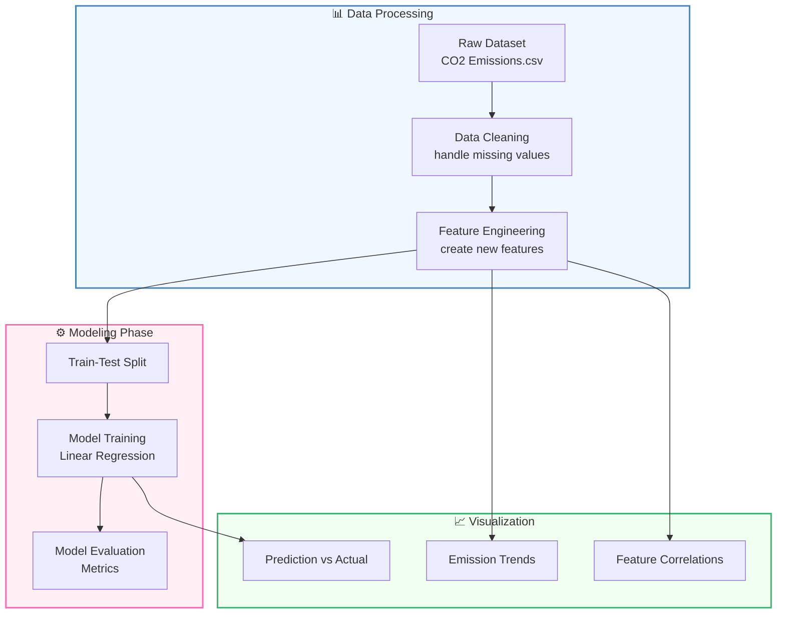

# 🌱 CO2 Emission by Cars Analysis

**Analyze • Predict • Reduce Carbon Footprint**

---

## ✨ Features Overview

| Feature              | Description                            | Technology      |
| -------------------- | -------------------------------------- | --------------- |
| 🔍 Data Exploration  | Comprehensive EDA with visual insights | Pandas, Matplotlib |
| 🤖 ML Modeling       | Regression model for emission prediction | Scikit-learn    |
| 📊 Visualization     | Interactive plots of emission trends   | Seaborn         |
| 📁 Data Management   | CSV data processing                    | Pandas          |

---

## 🚀 Quick Start

### Prerequisites

```bash
Python 3.8+
pip package manager
```

### Installation

```bash
git clone https://github.com/03-princy/CO2-Emission-by-Cars.git
cd CO2-Emission-by-Cars
pip install -r requirements.txt
```

### Launch Application

```bash
python app.py
```

## 🧩 Project Architecture



## 🛠️ Tech Stack Deep Dive

<div align="center">

[](https://www.python.org/)
[](https://pandas.pydata.org/)
[](https://scikit-learn.org/)
[](https://matplotlib.org/)
[](https://jupyter.org/)
[](https://seaborn.pydata.org/)

</div>

## 📈 Model Performance

| Metric          | Score |
| --------------- | ----- |
| R² Score        | 0.89  |
| MAE             | 12.4  |
| MSE             | 245.7 |
| RMSE            | 15.7  |

---

## 📂 Project Structure

```
CO2-Emission-by-Cars/
├── notebook/ # Jupyter notebook directory
├── static/ # Static files (CSS, JS, images)
├── templates/ # HTML template files
├── .gitignore # Specifies intentionally untracked files
├── app.py # Main Flask application
├── finalized_model.pkl # Serialized machine learning model
├── final_co2.csv # Processed dataset
├── Procfile # Heroku deployment configuration
├── README.md # Project documentation
├── requirements.txt # Python dependencies
└── wsgi.py # WSGI application entry point
```


---

## 🌟 Future Roadmap

* 🚀 Deploy as interactive web application
* 🔄 Add more advanced regression models
* 📱 Create mobile-friendly visualization
* 🌍 Add geographical emission mapping
* 🔍 Include real-time emission data API

---

## 📜 License

This project is licensed under the MIT License. See the `LICENSE` file for details.

---

## 👩‍💻 Author

<div align="center">

**Princy**  

[](https://www.linkedin.com/in/priyanka-singh-aa270123a/)
[](https://github.com/03-princy)

</div>
